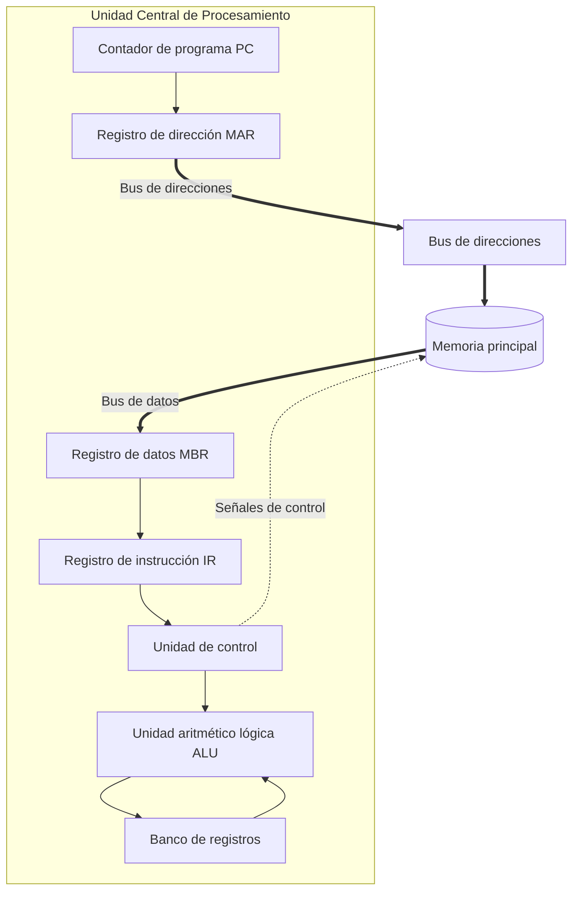
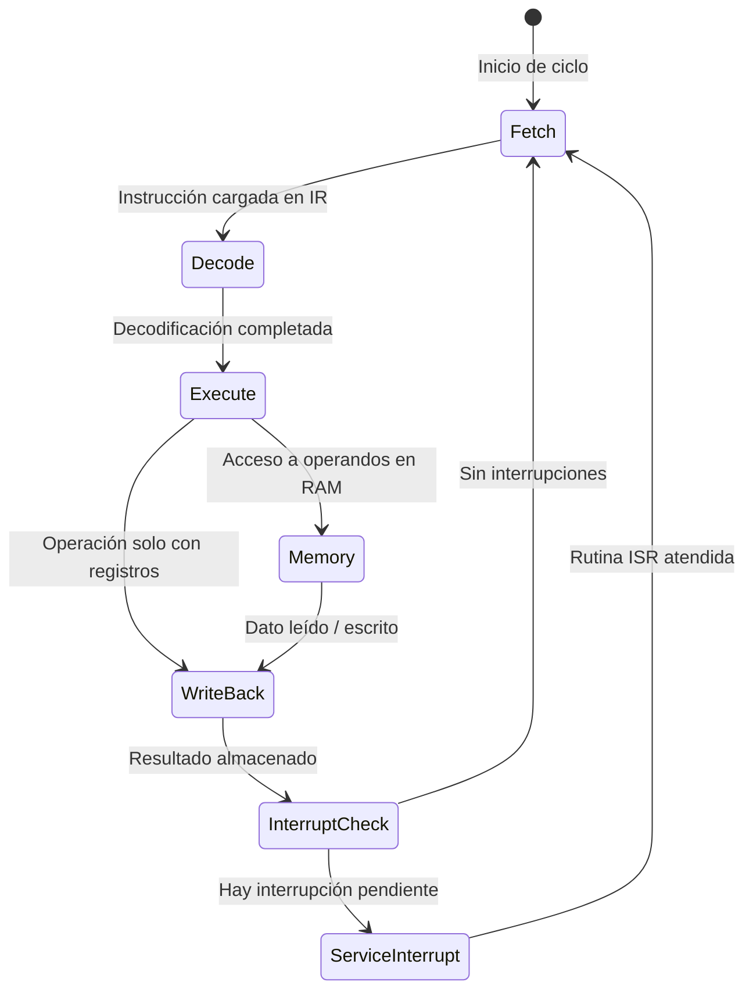

# Catálogo de Plantillas de Diagramas para Arquitectura de Computadores en Slidev

Este catálogo contiene componentes y plantillas listas para copiar y usar directamente en diapositivas de **Slidev** utilizando **Tailwind CSS**, **Mermaid** y **PlantUML**.

---

## 1. Subdivisión de Registros x86 / x86-64 (Tailwind Grid)

Excelente para explicar la anatomía de registros de 64, 32, 16 y 8 bits (ej. `RAX`, `EAX`, `AX`, `AH`, `AL`).

```html
<div class="w-full max-w-2xl mx-auto my-4 font-mono text-sm">
  <!-- RAX (64 bits) -->
  <div class="border-2 border-blue-600 bg-blue-900/20 rounded-lg p-2 mb-2">
    <div class="flex justify-between text-xs text-blue-400 mb-1 px-1">
      <span>63</span>
      <span>32</span>
      <span>31</span>
      <span>16</span>
      <span>15</span>
      <span>8</span>
      <span>7</span>
      <span>0</span>
    </div>
    <div class="grid grid-cols-8 gap-1 text-center font-bold">
      <div class="col-span-4 bg-blue-800/40 p-2 rounded border border-blue-700/50 flex items-center justify-center text-gray-400">
        Parte alta (Bits 63--32)
      </div>
      <!-- EAX (32 bits) -->
      <div class="col-span-4 border-2 border-emerald-500 bg-emerald-900/30 rounded p-1">
        <div class="text-xs text-emerald-400 mb-1">EAX (32 bits)</div>
        <div class="grid grid-cols-4 gap-1">
          <div class="col-span-2 bg-emerald-800/40 p-1.5 rounded border border-emerald-700/50 flex items-center justify-center text-xs text-gray-300">
            Bits 31--16
          </div>
          <!-- AX (16 bits) -->
          <div class="col-span-2 border-2 border-amber-500 bg-amber-900/30 rounded p-1">
            <div class="text-[10px] text-amber-400 mb-0.5">AX (16 bits)</div>
            <div class="grid grid-cols-2 gap-1 text-xs">
              <div class="bg-rose-800/60 p-1 rounded border border-rose-600 font-bold text-rose-200">
                AH (8b)
              </div>
              <div class="bg-indigo-800/60 p-1 rounded border border-indigo-600 font-bold text-indigo-200">
                AL (8b)
              </div>
            </div>
          </div>
        </div>
      </div>
    </div>
    <div class="text-center text-xs text-blue-300 mt-2 font-sans font-semibold">
      RAX (Registro acumulador de 64 bits)
    </div>
  </div>
</div>
```

---

## 2. Mapa de Memoria y Stack Frame (Pila de Ejecución)

Representa la estructura de la memoria y el marco de pila (*stack frame*) con punteros `$EBP` y `$ESP`.

```html
<div class="flex justify-center items-center gap-6 my-4 font-mono text-xs">
  <!-- Direcciones de memoria -->
  <div class="flex flex-col justify-between h-72 py-1 text-gray-400 text-right">
    <div>0xFFFFFFFF (Direcciones altas)</div>
    <div class="text-amber-400">EBP + 12 &rarr;</div>
    <div class="text-amber-400">EBP + 8 &rarr;</div>
    <div class="text-emerald-400">EBP + 4 &rarr;</div>
    <div class="text-cyan-400 font-bold">EBP &rarr;</div>
    <div class="text-rose-400">EBP - 4 &rarr;</div>
    <div class="text-purple-400 font-bold">ESP &rarr;</div>
    <div>0x00000000 (Direcciones bajas)</div>
  </div>

  <!-- Celdas de la pila -->
  <div class="w-64 border-2 border-gray-600 rounded-lg overflow-hidden flex flex-col bg-gray-900">
    <div class="bg-amber-900/40 border-b border-gray-700 p-2 text-center text-amber-200">
      Parámetro 2 (<span class="text-gray-400">arg2</span>)
    </div>
    <div class="bg-amber-900/40 border-b border-gray-700 p-2 text-center text-amber-200">
      Parámetro 1 (<span class="text-gray-400">arg1</span>)
    </div>
    <div class="bg-emerald-900/50 border-b border-gray-700 p-2 text-center text-emerald-200 font-bold">
      Dirección de retorno (<span class="text-gray-400">EIP guardado</span>)
    </div>
    <div class="bg-cyan-900/50 border-b-2 border-cyan-500 p-2 text-center text-cyan-200 font-bold">
      EBP previo guardado (<span class="text-gray-400">Old EBP</span>)
    </div>
    <div class="bg-rose-900/40 border-b border-gray-700 p-2 text-center text-rose-200">
      Variable local 1 (<span class="text-gray-400">EBP - 4</span>)
    </div>
    <div class="bg-rose-900/40 border-b border-dashed border-gray-600 p-2 text-center text-rose-200">
      Variable local 2 (<span class="text-gray-400">EBP - 8</span>)
    </div>
    <div class="bg-gray-800/50 p-2 text-center text-gray-400 italic">
      &darr; Crecimiento de la pila hacia abajo
    </div>
  </div>
</div>
```

---

## 3. Matriz de Ejecución de Pipeline con Riesgos (Stalls / Burbujas)

Visualiza etapas de segmentación (*Instruction Fetch, Decode, Execute, Memory, Write-back*) en ciclos de reloj.

```html
<div class="overflow-x-auto my-4 text-xs font-mono">
  <table class="w-full text-center border-collapse border border-gray-700">
    <thead>
      <tr class="bg-gray-800 text-gray-300">
        <th class="border border-gray-700 p-2 text-left">Instrucción</th>
        <th class="border border-gray-700 p-2">CC1</th>
        <th class="border border-gray-700 p-2">CC2</th>
        <th class="border border-gray-700 p-2">CC3</th>
        <th class="border border-gray-700 p-2">CC4</th>
        <th class="border border-gray-700 p-2">CC5</th>
        <th class="border border-gray-700 p-2">CC6</th>
        <th class="border border-gray-700 p-2">CC7</th>
      </tr>
    </thead>
    <tbody>
      <tr>
        <td class="border border-gray-700 p-2 text-left font-bold text-blue-300">I1: ADD EAX, EBX</td>
        <td class="bg-blue-900/50 text-blue-200 border border-gray-700 font-bold">IF</td>
        <td class="bg-emerald-900/50 text-emerald-200 border border-gray-700 font-bold">ID</td>
        <td class="bg-amber-900/50 text-amber-200 border border-gray-700 font-bold">EX</td>
        <td class="bg-purple-900/50 text-purple-200 border border-gray-700 font-bold">MEM</td>
        <td class="bg-rose-900/50 text-rose-200 border border-gray-700 font-bold">WB</td>
        <td class="border border-gray-700 text-gray-600">-</td>
        <td class="border border-gray-700 text-gray-600">-</td>
      </tr>
      <tr>
        <td class="border border-gray-700 p-2 text-left font-bold text-emerald-300">I2: SUB ECX, EAX</td>
        <td class="border border-gray-700 text-gray-600">-</td>
        <td class="bg-blue-900/50 text-blue-200 border border-gray-700 font-bold">IF</td>
        <td class="bg-emerald-900/50 text-emerald-200 border border-gray-700 font-bold">ID</td>
        <td class="bg-red-950 text-red-400 border border-red-800 font-bold italic animate-pulse">STALL</td>
        <td class="bg-amber-900/50 text-amber-200 border border-gray-700 font-bold">EX</td>
        <td class="bg-purple-900/50 text-purple-200 border border-gray-700 font-bold">MEM</td>
        <td class="bg-rose-900/50 text-rose-200 border border-gray-700 font-bold">WB</td>
      </tr>
      <tr>
        <td class="border border-gray-700 p-2 text-left font-bold text-gray-400">I3: MOV EDX, [ESI]</td>
        <td class="border border-gray-700 text-gray-600">-</td>
        <td class="border border-gray-700 text-gray-600">-</td>
        <td class="bg-blue-900/50 text-blue-200 border border-gray-700 font-bold">IF</td>
        <td class="bg-red-950 text-red-400 border border-red-800 font-bold italic">STALL</td>
        <td class="bg-emerald-900/50 text-emerald-200 border border-gray-700 font-bold">ID</td>
        <td class="bg-amber-900/50 text-amber-200 border border-gray-700 font-bold">EX</td>
        <td class="bg-purple-900/50 text-purple-200 border border-gray-700 font-bold">MEM</td>
      </tr>
    </tbody>
  </table>
</div>
```

---

## 4. Ciclo de Instrucción y Estructura de la CPU (Mermaid)



---

## 5. Jerarquía de Memoria (Tailwind Cards)

```html
<div class="grid grid-cols-1 gap-2 max-w-xl mx-auto my-3 text-xs font-sans">
  <div class="bg-rose-900/40 border border-rose-500 rounded p-2 flex justify-between items-center">
    <span class="font-bold text-rose-300">Registros de la CPU</span>
    <span class="text-gray-400">&lt; 1 ns &bull; &lt; 2 KB</span>
    <span class="text-rose-400 font-mono font-bold">Máxima velocidad</span>
  </div>
  <div class="bg-amber-900/40 border border-amber-500 rounded p-2 flex justify-between items-center">
    <span class="font-bold text-amber-300">Memoria caché (L1, L2, L3)</span>
    <span class="text-gray-400">1--10 ns &bull; 32 KB--64 MB</span>
    <span class="text-amber-400 font-mono font-bold">SRAM</span>
  </div>
  <div class="bg-emerald-900/40 border border-emerald-500 rounded p-2 flex justify-between items-center">
    <span class="font-bold text-emerald-300">Memoria principal (RAM)</span>
    <span class="text-gray-400">50--100 ns &bull; 8--64 GB</span>
    <span class="text-emerald-400 font-mono font-bold">DRAM</span>
  </div>
  <div class="bg-blue-900/40 border border-blue-500 rounded p-2 flex justify-between items-center">
    <span class="font-bold text-blue-300">Almacenamiento secundario (SSD / NVMe)</span>
    <span class="text-gray-400">10--100 &mu;s &bull; 512 GB--4 TB</span>
    <span class="text-blue-400 font-mono font-bold">Flash NAND</span>
  </div>
</div>
```

---

## 6. Diagrama de Estados del Procesador (Mermaid)



---

## 7. Diapositiva Divisoria de Sesión (Transición a Sesión 2)

Utilizar este patrón en `slides.md` para marcar el inicio de la segunda jornada de tutoría de la semana.

```md
---
layout: section
transition: slide-up
class: text-center
---

# Sesión 02: Taller práctico y profundización

<div class="text-xl text-blue-400 font-semibold mb-6">
  Semana 01 &bull; IC3101: Arquitectura de computadores
</div>

<div class="max-w-xl mx-auto bg-gray-800/60 border border-gray-700 rounded-xl p-4 text-left text-sm">
  <div class="text-xs uppercase tracking-wider text-gray-400 font-bold mb-2">
    Objetivos de la sesión práctica:
  </div>
  <ul class="space-y-1 text-gray-200">
    <li>&bull; Conversión manual y verificación de bases numéricas</li>
    <li>&bull; Configuración del entorno Linux y ensamblado con NASM</li>
    <li>&bull; Resolución de ejercicios de diagnóstico y quiz corto</li>
  </ul>
</div>

<!--
¡Bienvenidos a la segunda sesión de esta semana!

En la sesión anterior establecimos las bases conceptuales diferenciando arquitectura de organización y explorando el modelo del programador.

[click] Hoy nos pondremos manos a la obra con la parte práctica: conversiones de bases, preparación de nuestro entorno de ensamblador en Linux y la resolución guiada de ejercicios.

Abran su terminal y verifiquen que tengan acceso a su entorno. ¿Listos para comenzar?
-->
```

