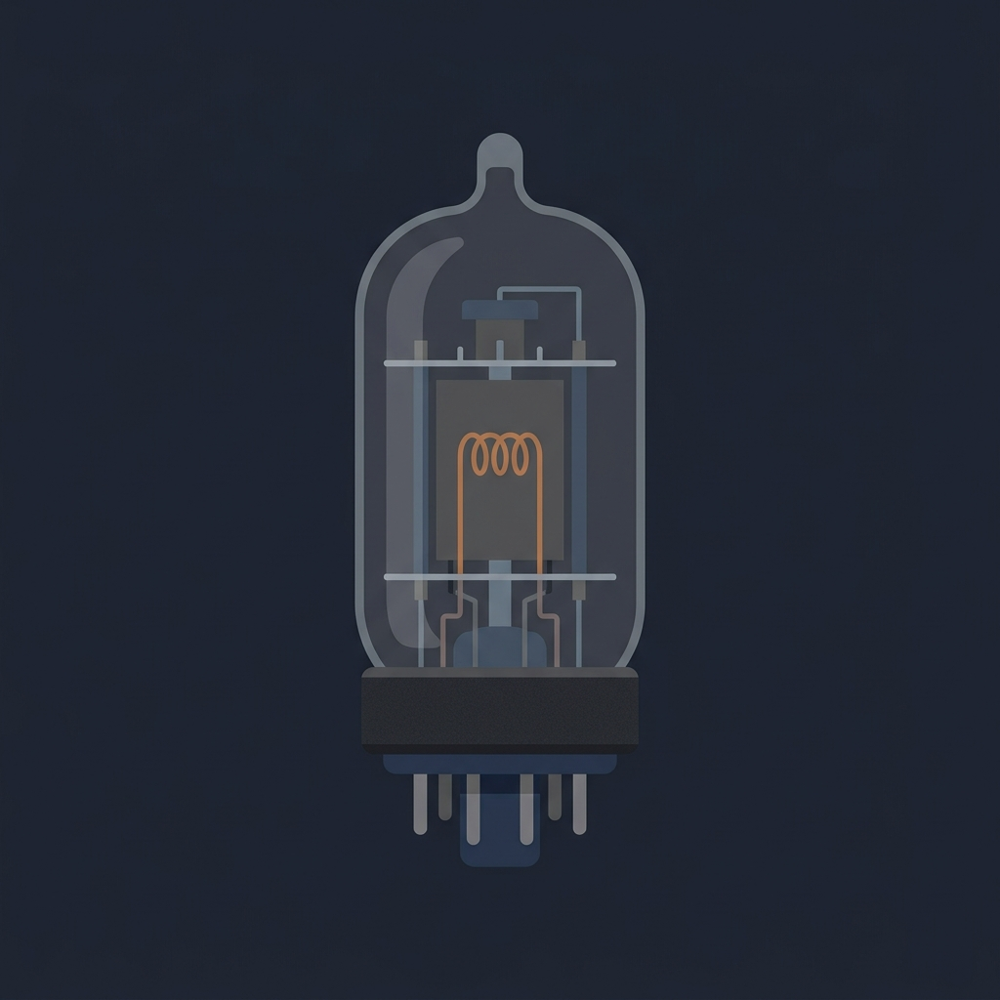
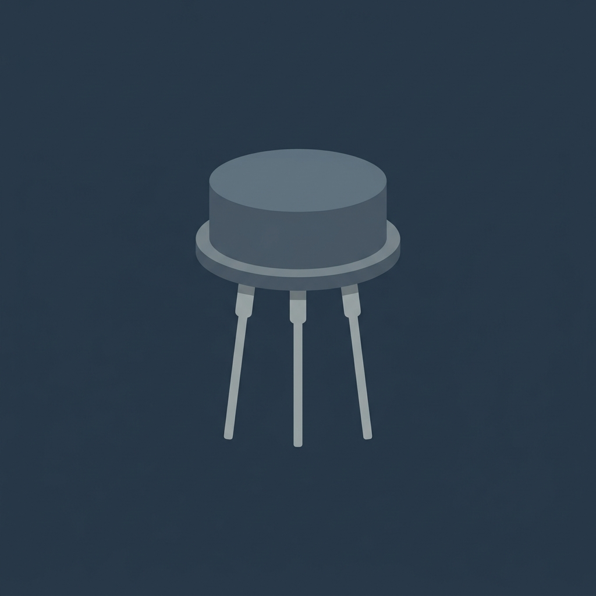
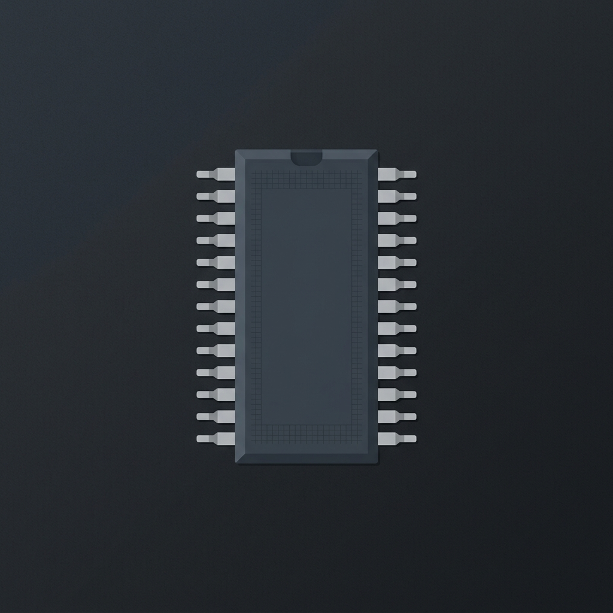
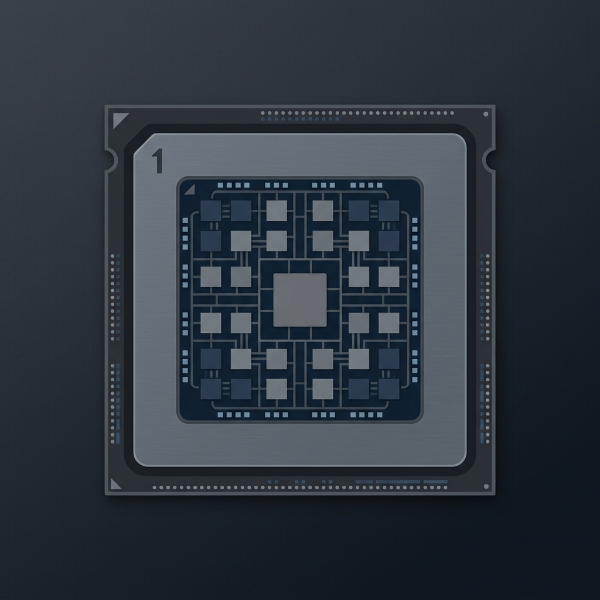
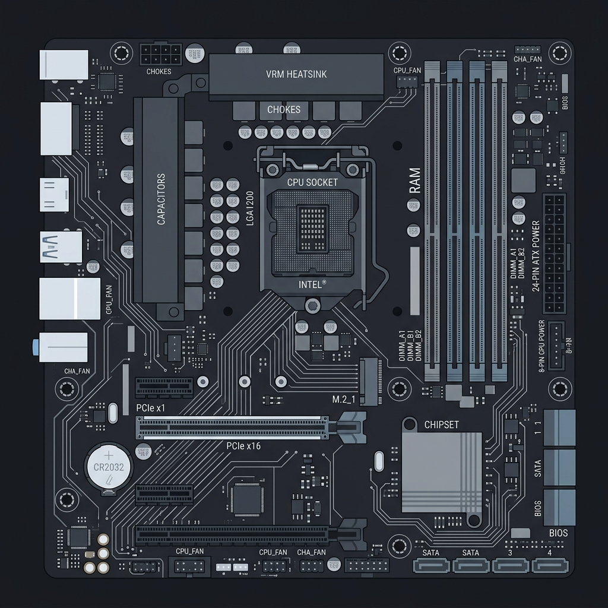
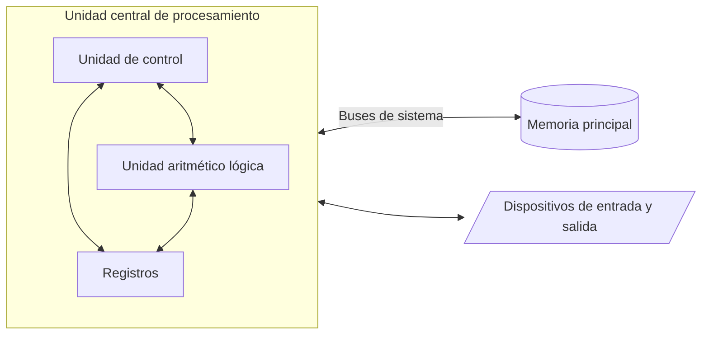

  
Semana 01

  <h1 class="text-6xl font-bold mb-8">Introducción a la arquitectura de computadoras</h1>
  
IC3101: Arquitectura de computadores

<!--
¡Hola a todos! Bienvenidos a la primera sesión del curso de Arquitectura de Computadores. En esta semana inicial, vamos a dar los primeros pasos para entender cómo están construidas las computadoras desde su base y cuáles son los conceptos fundamentales que guían su diseño.
-->

---
transition: fade
---

# Objetivos de la sesión

<v-clicks>

* Diferenciar entre arquitectura y organización de computadoras
* Comprender la evolución histórica de las computadoras
* Analizar la visión del programador de bajo nivel
* Entender los conceptos de rendimiento, frecuencia y CPI
* Realizar un diagnóstico inicial de programación y sistemas numéricos

</v-clicks>

<!--
Para la clase de hoy, tenemos varios objetivos importantes. 

Primero, queremos dejar muy clara la diferencia entre lo que es la arquitectura y lo que es la organización de una computadora.

Segundo, daremos un breve repaso por la evolución histórica de estas máquinas para entender cómo llegamos a la tecnología actual.

Tercero, nos pondremos en los zapatos de un programador de bajo nivel para ver cómo interactúa con el hardware.

Cuarto, introduciremos conceptos clave para medir el desempeño, como el rendimiento, la frecuencia y el CPI.

Y finalmente, haremos una pequeña actividad de diagnóstico para repasar temas de programación y sistemas numéricos que nos servirán a lo largo del curso.
-->

---
layout: two-cols
transition: slide-up
---

# Arquitectura y organización

La arquitectura se refiere a los atributos de un sistema visibles al programador, lo cual incluye el conjunto de instrucciones, la cantidad de bits utilizados para representar datos y los mecanismos de entrada y salida.

::right::

La organización describe cómo se implementan las características arquitectónicas ya que involucra detalles de hardware transparentes al programador, como las señales de control, las interfaces de memoria y la tecnología utilizada en el procesador.

Una misma arquitectura puede tener múltiples organizaciones dado que, por ejemplo, la familia x86 mantiene su arquitectura base pero su organización interna ha cambiado radicalmente a lo largo de los años para mejorar el rendimiento.

<!--
Comenzando con nuestro primer tema, es crucial distinguir entre arquitectura y organización. 

Por un lado, la arquitectura es todo aquello que el programador puede ver y utilizar directamente, como las instrucciones disponibles o cómo se manejan los datos en memoria. Es como el diseño de un automóvil desde la perspectiva del conductor: el volante, los pedales, el tablero.

Por otro lado, la organización es el cómo se construye internamente esa arquitectura. El programador no necesita saber cómo funciona el motor por dentro, qué tipo de inyección tiene o cómo están conectados los cables, pero el ingeniero sí. Eso es la organización.

Un ejemplo clásico es la arquitectura x86, que usamos en nuestras computadoras desde hace décadas. La arquitectura básica sigue siendo muy similar, pero la organización, es decir, cómo Intel o AMD diseñan el chip por dentro, cambia con cada nueva generación para hacerlas más rápidas y eficientes.
-->

---
layout: statement
transition: fade
---

# Evolución histórica

Las computadoras han evolucionado a través de distintas generaciones marcadas por cambios tecnológicos fundamentales.

<!--
Para entender la tecnología actual, es útil mirar brevemente hacia el pasado. La historia de las computadoras modernas se suele dividir en generaciones, y cada una de ellas está definida por un avance tecnológico disruptivo que cambió las reglas del juego.
-->

---
transition: slide-left
---

# Generaciones tecnológicas

  

    

      
      
Tubos de vacío

    

    

      
      
Transistores

    

    

      
      
Circuitos integrados

    

    

      
      
Microprocesadores

    

  

<!--
En cuanto a las generaciones, la primera usaba tubos de vacío, lo que resultaba en equipos masivos y con un alto consumo energético.

Luego pasamos a la segunda generación con los transistores, introduciendo equipos más pequeños y mucho más eficientes.

La tercera generación trajo los circuitos integrados, permitiendo agrupar miles de componentes en un solo chip.

Y finalmente, la cuarta generación integró una CPU completa en un circuito, naciendo así los microprocesadores, lo cual dio paso a las computadoras personales.
-->

---
transition: fade
---

# Visión del programador de bajo nivel

  

  
CPU

  
Memoria Principal

  
Registros

  
Instrucciones

<!--
Ahora bien, a nivel de hardware, el programador debe conocer cómo interactúan los componentes elementales del sistema para comprender su funcionamiento integral.

Los principales componentes serían el CPU, que ejecuta las instrucciones del programa.

La memoria principal, que almacena temporalmente los datos y el código que el CPU está procesando.

Los registros, que son pequeños espacios de almacenamiento ultrarrápidos dentro del CPU.

Y las instrucciones, que serían los comandos básicos que el procesador entiende y ejecuta de forma directa.
-->

---
transition: slide-up
---

# Interacción de componentes

La Unidad Central de Procesamiento se comunica constantemente con la memoria y los dispositivos periféricos para procesar la información de forma continua.

<v-click>

La Unidad de Control dirige el tráfico de datos mientras que la ALU realiza operaciones matemáticas y los registros proporcionan almacenamiento inmediato sin retrasos.

</v-click>

<!--
Viendo este esquema, podemos notar cómo es el flujo de trabajo continuo dentro del sistema. El procesador nunca trabaja aislado.

Por un lado, tenemos los buses del sistema que conectan la CPU con la memoria principal y con todos los dispositivos de entrada y salida, permitiendo el intercambio de información.

Dentro de la CPU, encontramos tres piezas fundamentales. La Unidad de Control es como el director de orquesta, indicando a los demás componentes qué hacer y cuándo. 

La Unidad Aritmético Lógica, o ALU, es la que realiza los cálculos matemáticos y lógicos reales. 

Y finalmente los registros, que brindan los datos a la ALU de manera casi instantánea para que pueda operar sin tener que esperar a la memoria principal.
-->

---
layout: two-cols
transition: slide-left
---

# Rendimiento y ejecución

El rendimiento de un sistema depende de qué tan rápido puede ejecutar un programa según sus especificaciones de hardware.

<v-clicks>

* **Frecuencia de reloj:** Mide los ciclos por segundo que el procesador puede realizar, normalmente en gigahercios.
* **Ciclos por instrucción:** Indica la cantidad promedio de ciclos de reloj que requiere una instrucción para ejecutarse.

</v-clicks>

::right::

El tiempo de ejecución es el tiempo real que toma completar un programa, el cual depende de la cantidad de instrucciones junto con el CPI y la frecuencia del reloj.

<!--
Pasando al tema de desempeño, ¿cómo sabemos si una computadora es rápida? Principalmente nos fijamos en el tiempo de ejecución, es decir, cuánto tarda en hacer un trabajo completo.

Hay dos métricas fundamentales a nivel de hardware que impactan este tiempo. 

Primero está la frecuencia de reloj. Imaginen que es el latido del corazón del procesador. Se mide en gigahercios y nos dice cuántos ciclos básicos puede completar en un segundo. 

Y segundo, tenemos el CPI, o ciclos por instrucción. No todas las instrucciones toman el mismo tiempo; algunas son simples y otras complejas. El CPI nos indica en promedio cuántos "latidos" se necesitan para terminar una instrucción.

Por tanto, para reducir el tiempo total de un programa, los diseñadores buscan aumentar la frecuencia de reloj o disminuir el CPI mejorando la organización interna del procesador.
-->

---
layout: center
transition: fade
---

# Espacios de práctica

Es momento de aplicar los conceptos iniciales y realizar un diagnóstico del grupo mediante los siguientes ejercicios.

  <v-clicks>
    
<strong>Diagnóstico de programación:</strong> Resolver un ejercicio corto en lenguaje C para evaluar el manejo de variables y ciclos básicos.

    
<strong>Sistemas numéricos:</strong> Conversión de números entre base decimal y base binaria en papel.

  </v-clicks>

<!--
Bien, ahora que hemos cubierto la teoría básica, vamos a poner manos a la obra. 

Vamos a dividirnos para realizar dos pequeños ejercicios de diagnóstico. Esto no tiene calificación directa, pero es vital para saber en qué nivel nos encontramos y qué temas de semestres anteriores necesitamos repasar más.

Primero haremos un pequeño código en C, para recordar la sintaxis, el uso de variables y los ciclos.

Y luego, haremos unos cuantos ejercicios a mano sobre conversión entre sistemas decimales y binarios, que es el idioma fundamental con el que nos estaremos comunicando con la máquina en este curso.
-->

---
transition: slide-up
---

# Cierre y evaluación

Para finalizar la sesión revisaremos lo aprendido contestando las siguientes preguntas de repaso:

<v-clicks>

1. Mencione una diferencia clave entre arquitectura y organización.
2. Liste los tres componentes principales dentro de la CPU vistos hoy.
3. Explique brevemente cómo influye el CPI en el tiempo de ejecución de un programa.

</v-clicks>

<!--
Para cerrar la sesión de hoy, me gustaría escuchar a algunos de ustedes contestar estas preguntas a modo de repaso. 

1. ¿Quién me puede decir con sus propias palabras la diferencia entre arquitectura y organización?
2. ¿Cuáles eran esos tres elementos clave que habitan dentro de la CPU según el diagrama que vimos?
3. Y por último, ¿cómo afecta el CPI al tiempo que toma ejecutar nuestro programa?

Con esto concluimos la materia por hoy, nos vemos la próxima semana.
-->
