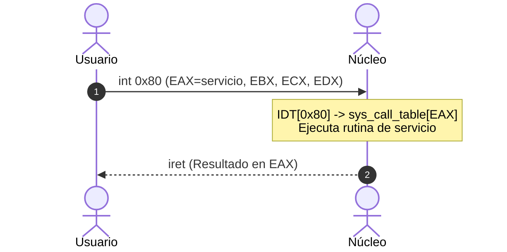

<div class="text-center">
  <div class="text-3xl text-gray-400 mb-4 font-mono">Semana 09</div>
  <h1 class="text-5xl font-bold mb-6">Llamadas al sistema e interacción con el OS</h1>
  <div class="text-2xl text-blue-400">IC3101: Arquitectura de computadores</div>
</div>

<!--
Hola a todos. Bienvenidos a la novena semana de tutorías de Arquitectura de Computadores.

Hasta este momento hemos trabajado con instrucciones que operan internamente sobre registros y memoria, como sumas, comparaciones, saltos condicionales y marcos de pila.

Hoy daremos un paso fundamental para conectar nuestros programas con el mundo exterior mediante las llamadas al sistema, comprendiendo la separación de privilegios del procesador y los mecanismos de entrada y salida en Linux.
-->

---
transition: fade
---

# Objetivos de la primera sesión

<div class="mb-4 text-sm text-gray-300">
Comprender la frontera entre el espacio de usuario y el núcleo mediante llamadas al sistema:
</div>

<v-clicks>

- **Modelo de protección y modo dual:** Distinguir el aislamiento entre el nivel de usuario y el nivel de núcleo en la arquitectura del procesador.
- **Mecanismo de interrupciones por software:** Analizar la instrucción <i>int 0x80</i> y la transición de contexto hacia el manejador de interrupciones.
- **Convención de llamadas al sistema en Linux:** Dominar la asignación de registros para el identificador del servicio y sus argumentos.
- **Descriptores de archivo estándar:** Manejar la entrada estándar, salida estándar y salida de error desde bajo nivel.
- **Segmentación de memoria en el ensamblador:** Identificar las secciones de código, datos inicializados y memoria no inicializada.

</v-clicks>

<!--
Antes de comenzar con la teoría, repasemos los objetivos de esta primera sesión:

[click] Primero, entenderemos cómo el procesador garantiza la estabilidad del sistema mediante el modo dual y los anillos de protección.

[click] Segundo, analizaremos el mecanismo de interrupción por software que permite solicitar servicios al sistema operativo de manera controlada.

[click] Tercero, aprenderemos la convención de registros para invocar llamadas al sistema bajo la arquitectura IA-32 en Linux.

[click] Cuarto, estudiaremos los descriptores de archivo estándar para entrada y salida.

[click] Y quinto, examinaremos la organización de la memoria del programa en secciones de datos, código y reserva.
-->

---
layout: two-cols
transition: slide-up | slide-down
---

# Jerarquía de privilegios x86

<div class="text-[11px] text-gray-300 mb-2">
Aislamiento por hardware mediante niveles de ejecución concéntricos:
</div>

<div v-click="1" class="p-2 bg-gray-900/60 border border-gray-800 rounded-lg text-xs mb-2">
  <div class="text-rose-400 font-bold text-[11px] mb-0.5">Espacio de núcleo</div>
  <p class="text-gray-300 text-[10px] leading-tight">
    Acceso irrestricto al hardware, tablas de páginas, memoria física y configuración de interrupciones.
  </p>
</div>

<div v-click="2" class="p-2 bg-gray-900/60 border border-gray-800 rounded-lg text-xs">
  <div class="text-blue-400 font-bold text-[11px] mb-0.5">Espacio de usuario</div>
  <p class="text-gray-300 text-[10px] leading-tight">
    Ejecuta aplicaciones comunes. Cualquier acceso directo al hardware detona un fallo de protección.
  </p>
</div>

::right::

<div v-click="3" class="bg-gray-900/90 border border-gray-800 rounded-xl p-3 text-center">
  <div class="text-blue-400 font-bold text-xs mb-2">Niveles de protección</div>

  <div class="relative w-44 h-44 mx-auto my-1 flex items-center justify-center font-sans">
    <div class="absolute inset-0 rounded-full border-2 border-blue-500 bg-blue-950/20 flex items-start justify-center pt-1">
      <span class="text-[9.5px] text-blue-300 font-bold tracking-wide">Aplicaciones</span>
    </div>
    <div class="absolute inset-5 rounded-full border-2 border-dashed border-amber-500 bg-amber-950/20 flex items-start justify-center pt-1">
      <span class="text-[8.5px] text-amber-300 font-bold">Controladores</span>
    </div>
    <div class="absolute inset-11 rounded-full border-2 border-rose-500 bg-rose-950/60 flex flex-col items-center justify-center shadow-lg shadow-rose-950/50">
      <span class="text-[11px] text-rose-300 font-bold leading-none">Núcleo</span>
      <span class="text-[7.5px] text-rose-200 font-mono mt-0.5">Sistema operativo</span>
    </div>
  </div>

  <div class="text-[9.5px] text-gray-400 font-sans mt-2">
    Mayor nivel de privilegio hacia el centro &bull; Aislamiento por hardware
  </div>
</div>

<!--
Comencemos analizando por qué existe la división de privilegios en el hardware.

En la arquitectura x86 existen cuatro anillos de protección numerados del 0 al 3. Los sistemas operativos como Linux utilizan principalmente dos: el anillo 0 y el anillo 3.

[click] En el espacio de núcleo reside el sistema operativo. Tiene control absoluto sobre la memoria física, la tabla de páginas y los controladores de dispositivos.

[click] Por otro lado, en el espacio de usuario se ejecutan nuestras aplicaciones habituales. Si una aplicación intenta ejecutar una instrucción privilegiada, la CPU detiene la ejecución inmediatamente.

[click] Observemos este diagrama. La capa exterior contiene las aplicaciones comunes, mientras que el núcleo reside en el centro con el nivel máximo de autoridad y protección del procesador.
-->

---
layout: two-cols
transition: slide-left | slide-right
---

# Mecanismo de interrupciones por software

<div class="text-[11px] text-gray-300 mb-1.5">
Transición sincrónica y segura entre el espacio de usuario y el núcleo:
</div>

<div class="space-y-1.5 text-xs">
<div v-click="1" class="p-2 bg-gray-900/60 border border-gray-800 rounded-lg">
  <span class="text-amber-400 font-bold text-[10.5px] block">1. Disparo de int 0x80:</span>
  <p class="text-gray-300 text-[10px]">
    El programa invoca una excepción por software controlada.
  </p>
</div>

<div v-click="2" class="p-2 bg-gray-900/60 border border-gray-800 rounded-lg">
  <span class="text-cyan-400 font-bold text-[10.5px] block">2. Cambio a modo privilegiado:</span>
  <p class="text-gray-300 text-[10px]">
    La CPU conmuta de modo y salta a la tabla <i>IDT[0x80]</i>.
  </p>
</div>

<div v-click="3" class="p-2 bg-gray-900/60 border border-gray-800 rounded-lg">
  <span class="text-emerald-400 font-bold text-[10.5px] block">3. Retorno con iret:</span>
  <p class="text-gray-300 text-[10px]">
    El núcleo retorna a espacio de usuario con el resultado en <i>EAX</i>.
  </p>
</div>
</div>

::right::

<div v-click="4" class="text-xs">



</div>

<!--
Veamos ahora qué ocurre internamente cuando invocamos una llamada al sistema.

[click] El primer paso ocurre en el programa de usuario, el cual configura los registros necesarios y ejecuta la instrucción int 0x80.

[click] Al recibir esta instrucción, la unidad central de procesamiento consulta la tabla de descriptores de interrupción en la posición 0x80, guarda el estado actual en la pila del núcleo y conmuta al nivel privilegiado.

[click] Una vez en el núcleo, el despachador general utiliza el valor de EAX como índice en la tabla de llamadas al sistema para ubicar la función requerida.

[click] Al finalizar el servicio, el núcleo deposita el resultado en el registro EAX y ejecuta la instrucción iret para restaurar el contexto original y regresar al espacio de usuario de forma transparente.
-->

---
layout: two-cols
transition: slide-up | slide-down
---

# Convención de llamadas en IA-32

<div class="text-[11px] text-gray-300 mb-1.5">
Asignación estandarizada de registros para transferir argumentos:
</div>

<div class="space-y-1 text-xs font-mono">
<div v-click="1" class="p-1.5 bg-gray-900/60 border border-gray-800 rounded-lg flex justify-between items-center">
  <span class="text-blue-400 font-bold text-[11px]">EAX</span>
  <span class="text-gray-300 font-sans text-[10px]">Número del servicio</span>
</div>

<div v-click="2" class="p-1.5 bg-gray-900/60 border border-gray-800 rounded-lg flex justify-between items-center">
  <span class="text-emerald-400 font-bold text-[11px]">EBX</span>
  <span class="text-gray-300 font-sans text-[10px]">Primer argumento (FD)</span>
</div>

<div v-click="3" class="p-1.5 bg-gray-900/60 border border-gray-800 rounded-lg flex justify-between items-center">
  <span class="text-amber-400 font-bold text-[11px]">ECX</span>
  <span class="text-gray-300 font-sans text-[10px]">Segundo argumento (Buffer)</span>
</div>

<div v-click="4" class="p-1.5 bg-gray-900/60 border border-gray-800 rounded-lg flex justify-between items-center">
  <span class="text-purple-400 font-bold text-[11px]">EDX</span>
  <span class="text-gray-300 font-sans text-[10px]">Tercer argumento (Bytes)</span>
</div>
</div>

::right::

<div class="space-y-1.5 text-xs">
<div v-click="5" class="p-2.5 bg-gray-900/80 border border-gray-800 rounded-xl">
  <div class="text-rose-400 font-bold mb-1 font-mono text-[10.5px]">Llamadas al sistema elementales</div>
  <table class="w-full text-left border-collapse text-[10px]">
    <thead>
      <tr class="text-gray-400 border-b border-gray-700">
        <th class="p-0.5">Servicio</th>
        <th class="p-0.5 font-mono">EAX</th>
        <th class="p-0.5 font-mono">EBX</th>
        <th class="p-0.5 font-mono">ECX</th>
        <th class="p-0.5 font-mono">EDX</th>
      </tr>
    </thead>
    <tbody class="text-gray-300 font-mono text-[9.5px]">
      <tr class="border-b border-gray-800">
        <td class="p-0.5 text-blue-300 font-bold">sys_exit</td>
        <td class="p-0.5">1</td>
        <td class="p-0.5">estado</td>
        <td class="p-0.5">-</td>
        <td class="p-0.5">-</td>
      </tr>
      <tr class="border-b border-gray-800">
        <td class="p-0.5 text-emerald-300 font-bold">sys_read</td>
        <td class="p-0.5">3</td>
        <td class="p-0.5">fd</td>
        <td class="p-0.5">buffer</td>
        <td class="p-0.5">conteo</td>
      </tr>
      <tr>
        <td class="p-0.5 text-amber-300 font-bold">sys_write</td>
        <td class="p-0.5">4</td>
        <td class="p-0.5">fd</td>
        <td class="p-0.5">buffer</td>
        <td class="p-0.5">conteo</td>
      </tr>
    </tbody>
  </table>
</div>

<div v-click="6" class="p-2 bg-gray-900/60 border border-gray-800 rounded-lg text-gray-400 font-sans text-[10px]">
  <span class="text-cyan-400 font-bold block mb-0.5">Valor de retorno:</span>
  Al completar, <i>EAX</i> almacena la cantidad de bytes procesados o un valor negativo de error (<i>EAX &lt; 0</i>).
</div>
</div>

<!--
Analicemos la convención de registros para invocar servicios en IA-32.

[click] El registro EAX es el más importante, pues contiene el número de servicio que identifica la llamada solicitada al sistema operativo.

[click] El registro EBX recibe el primer argumento de la llamada.

[click] El registro ECX recibe el segundo parámetro, típicamente la dirección de memoria donde se ubican los datos.

[click] Y el registro EDX contiene el tercer argumento, usualmente la cantidad máxima de bytes a transferir.

[click] En esta tabla resumimos las tres llamadas elementales con las que trabajaremos: sys_exit identificada con el número 1, sys_read con el número 3 y sys_write con el número 4.

[click] Tengamos presente que al volver de la interrupción, el resultado de la operación queda registrado en EAX.
-->

---
layout: two-cols
transition: slide-left | slide-right
---

# Descriptores de archivo en POSIX

<div class="text-[11px] text-gray-300 mb-1.5">
En UNIX/Linux, los flujos de E/S se manejan mediante números enteros (FD):
</div>

<div class="space-y-1 text-xs">
<div v-click="1" class="p-1.5 bg-gray-900/60 border border-gray-800 rounded-lg">
  <div class="flex justify-between font-mono text-emerald-400 font-bold text-[10.5px]">
    <span>stdin (FD 0)</span>
    <span>Teclado</span>
  </div>
  <p class="text-gray-400 font-sans text-[9.5px]">Flujo estándar para leer entradas del usuario.</p>
</div>

<div v-click="2" class="p-1.5 bg-gray-900/60 border border-gray-800 rounded-lg">
  <div class="flex justify-between font-mono text-blue-400 font-bold text-[10.5px]">
    <span>stdout (FD 1)</span>
    <span>Terminal</span>
  </div>
  <p class="text-gray-400 font-sans text-[9.5px]">Flujo estándar para emitir texto en pantalla.</p>
</div>

<div v-click="3" class="p-1.5 bg-gray-900/60 border border-gray-800 rounded-lg">
  <div class="flex justify-between font-mono text-rose-400 font-bold text-[10.5px]">
    <span>stderr (FD 2)</span>
    <span>Diagnósticos</span>
  </div>
  <p class="text-gray-400 font-sans text-[9.5px]">Canal independiente para diagnósticos y alertas.</p>
</div>
</div>

::right::

<div v-click="4" class="bg-gray-900/90 border border-gray-800 rounded-xl p-2.5 text-xs">
  <div class="text-amber-400 font-bold mb-1.5 text-center text-[10.5px]">Tabla de descriptores (PCB)</div>
  <div class="space-y-1 font-mono text-[9.5px]">
    <div class="flex items-center justify-between p-1 bg-emerald-950/30 border border-emerald-800/40 rounded">
      <span class="px-1 py-0.5 bg-emerald-900/80 rounded font-bold text-emerald-300">FD 0</span>
      <span class="text-gray-200">stdin</span>
      <span class="text-gray-400">Teclado</span>
    </div>
    <div class="flex items-center justify-between p-1 bg-blue-950/30 border border-blue-800/40 rounded">
      <span class="px-1 py-0.5 bg-blue-900/80 rounded font-bold text-blue-300">FD 1</span>
      <span class="text-gray-200">stdout</span>
      <span class="text-gray-400">Terminal</span>
    </div>
    <div class="flex items-center justify-between p-1 bg-rose-950/30 border border-rose-800/40 rounded">
      <span class="px-1 py-0.5 bg-rose-900/80 rounded font-bold text-rose-300">FD 2</span>
      <span class="text-gray-200">stderr</span>
      <span class="text-gray-400">Errores</span>
    </div>
    <div class="flex items-center justify-between p-1 bg-gray-800/40 border border-gray-700/50 rounded opacity-75">
      <span class="px-1 py-0.5 bg-gray-700 rounded font-bold text-gray-300">FD 3+</span>
      <span class="text-gray-200">archivos</span>
      <span class="text-gray-400">Disco</span>
    </div>
  </div>

  <div v-click="5" class="mt-1.5 p-1.5 bg-gray-950/80 border border-gray-800 rounded text-gray-300 font-sans text-[9.5px]">
    <span class="text-purple-400 font-bold">Asignación en EBX:</span>
    <i>EBX = 1</i> para escribir en consola (<i>sys_write</i>) y <i>EBX = 0</i> para leer de teclado (<i>sys_read</i>).
  </div>
</div>

<!--
Hablemos ahora de la abstracción de entrada y salida mediante descriptores de archivo.

En Linux todo se trata como un archivo o un flujo de bytes. Al iniciar cualquier proceso, el sistema operativo abre automáticamente tres canales fundamentales:

[click] El descriptor 0 corresponde a la entrada estándar, usualmente vinculada al teclado de la computadora.

[click] El descriptor 1 corresponde a la salida estándar, conectada a nuestra consola o emulador de terminal.

[click] Y el descriptor 2 es la salida de error estándar, diseñada para emitir diagnósticos.

[click] Observemos cómo la tabla interna del proceso asigna estos identificadores numéricos a los dispositivos físicos o archivos correspondientes.

[click] En ensamblador simplemente cargamos el número del descriptor en el registro EBX para indicar hacia dónde dirigir la lectura o la escritura.
-->

---
layout: two-cols
transition: slide-up | slide-down
---

# Secciones de memoria en NASM

<div class="text-[11px] text-gray-300 mb-1.5">
Organización del espacio de direcciones de un proceso:
</div>

<div class="space-y-1.5 text-xs font-mono">
<div v-click="1" class="p-1.5 bg-gray-900/60 border border-gray-800 rounded-lg">
  <div class="text-emerald-400 font-bold font-sans text-[10.5px]">Sección de código (.text)</div>
  <p class="text-gray-400 font-sans text-[10px]">Instrucciones con permisos de lectura y ejecución.</p>
</div>

<div v-click="2" class="p-1.5 bg-gray-900/60 border border-gray-800 rounded-lg">
  <div class="text-blue-400 font-bold font-sans text-[10.5px]">Sección de datos (.data)</div>
  <p class="text-gray-400 font-sans text-[10px]">Variables globales y constantes inicializadas.</p>
</div>

<div v-click="3" class="p-1.5 bg-gray-900/60 border border-gray-800 rounded-lg">
  <div class="text-amber-400 font-bold font-sans text-[10.5px]">Sección de reserva (.bss)</div>
  <p class="text-gray-400 font-sans text-[10px]">Buffers no inicializados (asigna memoria en tiempo de ejecución).</p>
</div>
</div>

::right::

<div class="font-mono text-xs">
<div v-click="4" class="p-2.5 bg-gray-900/80 border border-gray-800 rounded-xl text-[9.5px]">
<div class="text-cyan-400 font-bold mb-1 text-center font-sans text-[10.5px]">Estructura del archivo fuente</div>

```asm
section .data
  mensaje db "Hola mundo", 0x0A
  longitud equ $ - mensaje

section .bss
  buffer resb 64

section .text
  global _start

_start:
  ; Código ejecutable
```

</div>

<div v-click="5" class="mt-1.5 p-1.5 bg-gray-900/60 border border-gray-800 rounded-lg text-gray-300 font-sans text-[10px]">
  <span class="text-rose-400 font-bold block">Eficiencia de BSS:</span>
  No incrementa el peso del binario en disco porque el cargador la inicializa con ceros en RAM al iniciar.
</div>
</div>

<!--
Revisemos cómo organizamos el código fuente en NASM.

[click] La sección punto text contiene la secuencia de instrucciones que ejecutará el procesador. Tiene permisos de sólo lectura y ejecución para impedir que el programa se modifique a sí mismo accidentalmente.

[click] La sección punto data alberga las variables y cadenas de caracteres con valores iniciales conocidos desde el momento de compilar.

[click] La sección punto bss se utiliza para reservar memoria para variables y buffers que recibirán datos durante la ejecución, como la entrada del usuario.

[click] Aquí apreciamos la estructura típica de un archivo en ensamblador con sus tres secciones bien delimitadas.

[click] Notemos que la sección BSS es sumamente eficiente, puesto que reservar un buffer de sesenta y cuatro bytes no agrega ningún peso al archivo binario generado en disco.
-->

---
layout: two-cols
transition: slide-left | slide-right
---

# Directivas de definición y reserva

<div class="text-[11px] text-gray-300 mb-1.5">
Diferenciación estricta entre datos inicializados y reservas vacías:
</div>

<div class="space-y-1.5 text-xs font-mono">
<div v-click="1" class="p-2 bg-gray-900/60 border border-gray-800 rounded-lg">
  <div class="text-emerald-400 font-bold font-sans text-[10.5px] mb-0.5">Definición en .data</div>
  <ul class="space-y-0.5 text-gray-300 text-[10px]">
    <li><i>db</i>: Byte (8 bits) &nbsp;|&nbsp; <i>dw</i>: Word (16 bits)</li>
    <li><i>dd</i>: DWord (32 bits) &nbsp;|&nbsp; <i>dq</i>: QWord (64 bits)</li>
  </ul>
</div>

<div v-click="2" class="p-2 bg-gray-900/60 border border-gray-800 rounded-lg">
  <div class="text-amber-400 font-bold font-sans text-[10.5px] mb-0.5">Reserva en .bss</div>
  <ul class="space-y-0.5 text-gray-300 text-[10px]">
    <li><i>resb N</i>: Reserva N bytes</li>
    <li><i>resd N</i>: Reserva N palabras dobles (32b)</li>
  </ul>
</div>
</div>

::right::

<div class="space-y-1.5 text-xs font-mono">
<div v-click="3" class="p-2.5 bg-gray-900/80 border border-gray-800 rounded-xl">
<div class="text-blue-400 font-bold mb-1 font-sans text-[10.5px]">Cálculo automático de longitud</div>

```asm
section .data
  saludo db "Bienvenido al curso", 0x0A
  len equ $ - saludo
```

<p class="mt-1 text-gray-400 font-sans text-[9.5px]">
El símbolo <i>$</i> indica la posición actual. Al restar la etiqueta <i>saludo</i>, NASM calcula los bytes exactos.
</p>
</div>

<div v-click="4" class="p-1.5 bg-gray-900/60 border border-gray-800 rounded-lg text-gray-300 font-sans text-[10px]">
  <span class="text-purple-400 font-bold">Directiva equ:</span>
  Define constantes simbólicas en tiempo de ensamblado sin gastar memoria.
</div>
</div>

<!--
Veamos en detalle las directivas de datos que utilizaremos en nuestras prácticas.

[click] Para inicializar variables en la sección de datos usamos db para bytes individuales, dw para palabras de dieciséis bits y dd para palabras dobles de treinta y dos bits.

[click] En contraste, dentro de la sección BSS usamos resb, resw o resd acompañados de un número entero que indica la cantidad de elementos vacíos a reservar.

[click] Una técnica muy elegante para no contar caracteres manualmente es usar el operador signo de dólar menos la etiqueta de inicio. Esto calcula la longitud exacta en bytes de forma automática.

[click] La directiva equ crea una constante simbólica en tiempo de ensamblado, facilitando un código limpio y mantenible.
-->

---
layout: two-cols
transition: slide-up | slide-down
---

# Ejemplo guiado: Salida en consola

<div class="text-[11px] text-gray-300 mb-1">
Programa completo para imprimir un texto y terminar con llamada al sistema:
</div>

<div class="font-mono text-[9px]">

```asm {1-3|8-12|14-17|all}
section .data
  msg db "Arquitectura de Computadores", 0x0A
  len equ $ - msg

section .text
  global _start

_start:
  ; Escribir mensaje en stdout
  mov eax, 4          ; sys_write
  mov ebx, 1          ; stdout
  mov ecx, msg        ; dirección buffer
  mov edx, len        ; cantidad bytes
  int 0x80            ; invocar kernel

  ; Terminar proceso
  mov eax, 1          ; sys_exit
  mov ebx, 0          ; exit code 0
  int 0x80            ; invocar kernel
```

</div>

::right::

<div class="space-y-1.5 text-xs">
<div v-click="1" class="p-2 bg-gray-900/60 border border-gray-800 rounded-lg">
  <span class="text-emerald-400 font-bold font-mono text-[10.5px] block">sys_write (EAX = 4):</span>
  <p class="text-gray-300 font-sans text-[10px]">
    Carga descriptor 1 en <i>EBX</i>, puntero <i>msg</i> en <i>ECX</i> y longitud en <i>EDX</i>.
  </p>
</div>

<div v-click="2" class="p-2 bg-gray-900/60 border border-gray-800 rounded-lg">
  <span class="text-blue-400 font-bold font-mono text-[10.5px] block">sys_exit (EAX = 1):</span>
  <p class="text-gray-300 font-sans text-[10px]">
    Cierra el proceso con código 0 evitando fallos de segmentación.
  </p>
</div>

<div v-click="3" class="p-1.5 bg-gray-900/60 border border-gray-800 rounded-lg font-mono text-[9px] text-gray-300">
  <span class="text-amber-400 font-bold font-sans text-[10px] block mb-0.5">Compilación:</span>
  <div>nasm -f elf32 prog.asm -o prog.o</div>
  <div>ld -m elf_i386 prog.o -o prog && ./prog</div>
</div>
</div>

<!--
Analicemos este primer programa completo.

[click] Para emitir el mensaje por pantalla, configuramos EAX con el número cuatro correspondiente a sys_write, EBX con uno para la salida estándar, ECX con la dirección de la cadena y EDX con la longitud.

[click] Luego ejecutamos int 0x80 para que el sistema operativo realice la escritura. Inmediatamente después preparamos la llamada sys_exit con código cero para cerrar el proceso de forma limpia.

[click] Para ensamblar y enlazar este código en Linux de 32 bits utilizamos nasm con formato elf32 y ld con emulación elf_i386.
-->

---
transition: fade
---

# Síntesis de la primera sesión

<div class="max-w-xl mx-auto text-left space-y-2.5 text-xs">
  <div class="p-2.5 bg-gray-900/80 border border-gray-800 rounded-lg">
    <strong class="text-rose-400 font-mono">1. Aislamiento por hardware:</strong>
    <p class="text-gray-300 mt-0.5 text-[11px]">
      El modo dual garantiza que las operaciones sobre hardware se gestionen exclusivamente en el nivel de núcleo.
    </p>
  </div>

  <div class="p-2.5 bg-gray-900/80 border border-gray-800 rounded-lg">
    <strong class="text-emerald-400 font-mono">2. Interfaz de llamadas:</strong>
    <p class="text-gray-300 mt-0.5 text-[11px]">
      Las llamadas en IA-32 utilizan <i>EAX</i> para el código de servicio y los registros <i>EBX</i>, <i>ECX</i> y <i>EDX</i> para los parámetros.
    </p>
  </div>

  <div v-click="1" class="p-2.5 bg-gray-900/80 border border-gray-800 rounded-lg">
    <strong class="text-amber-400 font-mono">3. Pregunta detonante para el taller:</strong>
    <p class="text-gray-300 mt-0.5 text-[11px] italic">
      Al capturar texto desde el teclado con <i>sys_read</i>, ¿cómo gestionamos el byte de fin de línea <i>0x0A</i> para convertirlo en una cadena compatible con C?
    </p>
  </div>
</div>

<!--
Con esto concluimos la primera sesión teórica. Hemos cubierto los principios de protección por hardware, la tabla de llamadas al sistema y la segmentación en ensamblador.

[click] Les dejo esta pregunta detonante para reflexionar antes del taller práctico: cuando el usuario escribe en consola y presiona Enter, ¿cómo limpiamos el carácter de salto de línea en memoria?
-->

---
layout: center
transition: slide-up | slide-down
---

<div class="text-center">
  <div class="text-3xl text-gray-400 mb-4 font-mono">Semana 09</div>
  <h1 class="text-6xl font-bold mb-8">Sesión 02: Taller práctico</h1>
  <div class="text-2xl text-blue-500 mt-4">IC3101: Arquitectura de computadores</div>
</div>

<!--
¡Bienvenidos a la segunda sesión de la semana!

Habiendo cubierto toda la base teórica de la separación de privilegios y la interfaz de llamadas al sistema, dedicaremos esta jornada completa al taller práctico y la resolución de ejercicios paso a paso.
-->

---
transition: fade
---

# Objetivos de la segunda sesión

<div class="mb-4 text-sm text-gray-300">
Desarrollar destrezas prácticas de entrada y salida interactiva y depuración a bajo nivel:
</div>

<v-clicks>

- **Captura interactiva con sys_read:** Configurar buffers de recepción y procesar entradas del usuario desde el teclado.
- **Gestión de memoria no inicializada:** Reservar y manipular espacio dinámico en la sección <i>.bss</i>.
- **Tratamiento de cadenas en memoria:** Detectar y suprimir saltos de línea para estructurar cadenas terminadas en nulo (ASCIIZ).
- **Inspección con depurador GDB:** Examinar registros, banderas y contenido de memoria paso a paso en tiempo de ejecución.
- **Resolución de problemas de bajo nivel:** Prevenir errores críticos como fallos de segmentación y sobreescritura de registros.

</v-clicks>

<!--
Antes de iniciar los ejercicios, repasemos los objetivos de esta segunda sesión práctica:

[click] Primero, implementaremos la lectura interactiva desde teclado con sys_read.

[click] Segundo, gestionaremos la memoria de trabajo en la sección BSS para almacenar la información recibida.

[click] Tercero, aprenderemos a sanitizar cadenas suprimiendo el byte de salto de línea.

[click] Cuarto, utilizaremos el depurador GDB para inspeccionar registros y memoria en vivo.

[click] Y quinto, analizaremos los errores más comunes al interactuar con el sistema operativo para evitar comportamientos anómalos.
-->

---
layout: two-cols
transition: slide-left | slide-right
---

# Captura con sys_read

<div class="text-[11px] text-gray-300 mb-1.5">
La llamada <i>sys_read</i> suspende la ejecución hasta recibir la entrada del usuario:
</div>

<div class="space-y-1.5 text-xs font-mono">
<div v-click="1" class="p-2 bg-gray-900/60 border border-gray-800 rounded-lg">
  <div class="text-emerald-400 font-bold font-sans text-[10.5px] mb-0.5">Configuración de registros:</div>
  <ul class="space-y-0.5 text-gray-300 text-[10px]">
    <li><i>mov eax, 3</i> (sys_read) &nbsp;|&nbsp; <i>mov ebx, 0</i> (stdin)</li>
    <li><i>mov ecx, buffer</i> &nbsp;|&nbsp; <i>mov edx, 64</i> (capacidad)</li>
  </ul>
</div>

<div v-click="2" class="p-2 bg-gray-900/60 border border-gray-800 rounded-lg text-gray-300 font-sans text-xs">
  <span class="text-amber-400 font-bold font-mono text-[10.5px] block">Retorno en EAX:</span>
  Al volver, <i>EAX</i> contiene los bytes leídos incluyendo el salto de línea <i>0x0A</i> (<i>\n</i>).
</div>
</div>

::right::

<div v-click="3" class="bg-gray-900/90 border border-gray-800 rounded-xl p-2.5 text-xs">
  <div class="text-blue-400 font-bold mb-1 text-center text-[10.5px]">Buffer en memoria (.bss)</div>
  <div class="text-[9.5px] text-gray-400 text-center mb-1.5">Entrada capturada: <span class="text-white font-bold">'J' 'u' 'a' 'n' [Enter]</span></div>
  
  <div class="grid grid-cols-5 gap-1 text-center font-mono text-[10px] mb-1.5">
    <div class="border border-blue-500/50 bg-blue-950/40 rounded p-1">
      <div class="text-[8px] text-gray-400">+0</div>
      <div class="font-bold text-blue-300 text-xs">J</div>
      <div class="text-[7.5px] text-gray-500">0x4A</div>
    </div>
    <div class="border border-blue-500/50 bg-blue-950/40 rounded p-1">
      <div class="text-[8px] text-gray-400">+1</div>
      <div class="font-bold text-blue-300 text-xs">u</div>
      <div class="text-[7.5px] text-gray-500">0x75</div>
    </div>
    <div class="border border-blue-500/50 bg-blue-950/40 rounded p-1">
      <div class="text-[8px] text-gray-400">+2</div>
      <div class="font-bold text-blue-300 text-xs">a</div>
      <div class="text-[7.5px] text-gray-500">0x61</div>
    </div>
    <div class="border border-blue-500/50 bg-blue-950/40 rounded p-1">
      <div class="text-[8px] text-gray-400">+3</div>
      <div class="font-bold text-blue-300 text-xs">n</div>
      <div class="text-[7.5px] text-gray-500">0x6E</div>
    </div>
    <div class="border border-amber-500/60 bg-amber-950/40 rounded p-1">
      <div class="text-[8px] text-amber-400">+4</div>
      <div class="font-bold text-amber-300 text-xs">\n</div>
      <div class="text-[7.5px] text-amber-400">0x0A</div>
    </div>
  </div>

  <div class="flex justify-between items-center bg-gray-950/80 p-1 rounded border border-gray-800 text-[10px] font-mono">
    <span class="text-gray-400 font-sans">Retorno en EAX:</span>
    <span class="text-emerald-400 font-bold">5 bytes</span>
  </div>
</div>

<!--
Entremos al taller práctico revisando cómo funciona sys_read.

[click] Para leer datos, configuramos EAX con el valor tres, EBX con cero correspondiente a stdin, ECX con la dirección del buffer donde se guardará la entrada y EDX con la capacidad máxima.

[click] Un detalle fundamental es que al retornar de la interrupción, EAX almacena la cantidad exacta de bytes que el usuario escribió.

[click] Observemos este diagrama en memoria. Si el usuario escribe el nombre Juan y presiona Enter, el buffer contendrá las cuatro letras más el byte 0x0A del salto de línea, totalizando cinco bytes en EAX.

[click] Notemos la importancia de pasar en EDX el tamaño real del buffer para evitar cualquier desbordamiento de memoria.
-->

---
layout: two-cols
transition: slide-up | slide-down
---

# Taller 1: Saludo interactivo

<div class="text-[11px] text-gray-300 mb-1">
Programa interactivo para solicitar nombre y emitir saludo:
</div>

<div class="font-mono text-[9px]">

```asm
section .data
  preg db "Ingrese su nombre: "
  l_preg equ $ - preg
  sal db "Hola, "
  l_sal equ $ - sal

section .bss
  nom resb 32
  bytes_leidos resd 1

section .text
  global _start

_start:
  ; Mostrar pregunta
  mov eax, 4
  mov ebx, 1
  mov ecx, preg
  mov edx, l_preg
  int 0x80

  ; Leer entrada
  mov eax, 3
  mov ebx, 0
  mov ecx, nom
  mov edx, 32
  int 0x80
  mov [bytes_leidos], eax
```

</div>

::right::

<div class="font-mono text-[9px]">

```asm
  ; Imprimir 'Hola, '
  mov eax, 4
  mov ebx, 1
  mov ecx, sal
  mov edx, l_sal
  int 0x80

  ; Imprimir nombre capturado
  mov eax, 4
  mov ebx, 1
  mov ecx, nom
  mov edx, [bytes_leidos]
  int 0x80

  ; Salir del programa
  mov eax, 1
  mov ebx, 0
  int 0x80
```

<div v-click="1" class="mt-1.5 p-1.5 bg-gray-900/60 border border-gray-800 rounded-lg text-gray-300 font-sans text-[10px]">
  <span class="text-emerald-400 font-bold block mb-0.5">Uso del retorno:</span>
  Guardamos <i>EAX</i> en <i>bytes_leidos</i> para imprimir exactamente los caracteres recibidos.
</div>
</div>

<!--
Construyamos este programa interactivo paso a paso.

Primero mostramos el mensaje de solicitud en consola con sys_write.

Luego invocamos sys_read pasando nuestro buffer nombre de treinta y dos bytes. Observemos cómo guardamos el conteo que retorna EAX en la variable bytes_leidos.

[click] Finalmente imprimimos la palabra Hola seguida directamente del contenido de nuestro buffer con la cantidad exacta de bytes leídos antes de invocar sys_exit.
-->

---
layout: two-cols
transition: slide-left | slide-right
---

# Supresión del salto de línea

<div class="text-[11px] text-gray-300 mb-1.5">
Sustitución del byte <i>0x0A</i> por el terminador nulo <i>0x00</i> (ASCIIZ):
</div>

<div class="font-mono text-[9.5px]">

```asm
  ; EAX = bytes leídos (ej. 5)
  ; nom = dirección base

  dec eax             ; Índice 4 (0x0A)
  mov byte [nom + eax], 0x00 ; Reemplazar NULL
```

<div v-click="1" class="mt-2 p-2 bg-gray-900/60 border border-gray-800 rounded-lg text-gray-300 font-sans text-[10px]">
  <span class="text-amber-400 font-bold block mb-0.5">Indexación base + índice:</span>
  <i>[nom + eax]</i> calcula la dirección exacta del byte de fin de línea.
</div>
</div>

::right::

<div v-click="2" class="bg-gray-900/90 border border-gray-800 rounded-xl p-2.5 text-xs">
  <div class="text-cyan-400 font-bold mb-1.5 text-center text-[10.5px]">Transformación del buffer</div>
  
  <div class="mb-1">
    <div class="text-[9px] text-gray-400 mb-0.5 font-sans">Tras sys_read (EAX = 5):</div>
    <div class="grid grid-cols-5 gap-1 text-center font-mono text-[10px]">
      <div class="bg-gray-800/80 border border-gray-700 rounded p-1 text-gray-300">J</div>
      <div class="bg-gray-800/80 border border-gray-700 rounded p-1 text-gray-300">u</div>
      <div class="bg-gray-800/80 border border-gray-700 rounded p-1 text-gray-300">a</div>
      <div class="bg-gray-800/80 border border-gray-700 rounded p-1 text-gray-300">n</div>
      <div class="bg-rose-950/40 border border-rose-600/60 rounded p-1 text-rose-300 font-bold">0x0A</div>
    </div>
  </div>

  <div class="text-center text-amber-400 text-[10px] my-0.5 font-mono font-bold">
    &darr; mov byte [nom + eax], 0x00 &darr;
  </div>

  <div>
    <div class="text-[9px] text-gray-400 mb-0.5 font-sans">Cadena ASCIIZ lista:</div>
    <div class="grid grid-cols-5 gap-1 text-center font-mono text-[10px]">
      <div class="bg-gray-800/80 border border-gray-700 rounded p-1 text-gray-300">J</div>
      <div class="bg-gray-800/80 border border-gray-700 rounded p-1 text-gray-300">u</div>
      <div class="bg-gray-800/80 border border-gray-700 rounded p-1 text-gray-300">a</div>
      <div class="bg-gray-800/80 border border-gray-700 rounded p-1 text-gray-300">n</div>
      <div class="bg-emerald-950/40 border border-emerald-600/60 rounded p-1 text-emerald-300 font-bold">0x00</div>
    </div>
  </div>
</div>

<!--
Un problema muy común al leer texto del usuario es que el salto de línea queda guardado dentro del buffer.

Si leímos cinco bytes, los índices van del cero al cuatro, por lo que el salto de línea está en la posición cuatro.

[click] Restamos uno a EAX con dec eax y escribimos un byte cero en la posición calculada mediante direccionamiento indexado.

[click] Observemos la transformación gráfica en la columna derecha. El byte 0x0A se sustituye por 0x00.

[click] Esto transforma la entrada en una cadena terminada en nulo, compatible con las funciones del lenguaje C.
-->

---
layout: two-cols
transition: slide-up | slide-down
---

# Taller 2: Depuración con GDB

<div class="text-[11px] text-gray-300 mb-1.5">
Inspección de registros y memoria en tiempo de ejecución:
</div>

<div class="space-y-1.5 text-xs font-mono">
<div v-click="1" class="p-1.5 bg-gray-900/60 border border-gray-800 rounded-lg">
  <span class="text-emerald-400 font-bold font-sans text-[10.5px] block">Símbolos de depuración:</span>
  <div class="text-gray-300 text-[9.5px]">
    nasm -f elf32 -g -F dwarf prog.asm<br>
    ld -m elf_i386 prog.o -o prog
  </div>
</div>

<div v-click="2" class="p-1.5 bg-gray-900/60 border border-gray-800 rounded-lg">
  <span class="text-blue-400 font-bold font-sans text-[10.5px] block">Comandos básicos:</span>
  <div class="text-gray-300 text-[9.5px]">
    (gdb) break _start<br>
    (gdb) run &nbsp;|&nbsp; nexti &nbsp;|&nbsp; stepi
  </div>
</div>
</div>

::right::

<div class="space-y-1.5 text-xs font-mono">
<div v-click="3" class="p-2 bg-gray-900/80 border border-gray-800 rounded-xl text-[9px]">
<div class="text-amber-400 font-bold mb-0.5 font-sans text-center text-[10.5px]">Inspección de estado</div>

```text
(gdb) info registers eax ebx ecx edx
eax  0x4    4
ebx  0x1    1
ecx  0x8049000  134516736
edx  0x1b   27

(gdb) x/s 0x8049000
"Arquitectura de Computadores\n"
```

</div>

<div v-click="4" class="p-1.5 bg-gray-900/60 border border-gray-800 rounded-lg text-gray-300 font-sans text-[10px]">
  <span class="text-purple-400 font-bold block">Comando examine (x):</span>
  <i>x/s</i> (texto), <i>x/16xb</i> (bytes hex), <i>x/i</i> (instrucciones).
</div>
</div>

<!--
Veamos ahora cómo utilizar GDB para depurar nuestros programas en ensamblador.

[click] Al ensamblar con NASM debemos incluir los parámetros menos g y menos F dwarf para generar la tabla de símbolos de depuración.

[click] Dentro de GDB colocamos un punto de interrupción en _start con break y avanzamos instrucción por instrucción con nexti o stepi.

[click] Con info registers verificamos que los parámetros de la llamada al sistema estén correctamente colocados en EAX, EBX, ECX y EDX.

[click] El comando examine nos permite ver los caracteres exactos dentro de nuestro buffer para confirmar que los datos se leyeron adecuadamente.
-->

---
layout: two-cols
transition: slide-left | slide-right
---

# Errores comunes en llamadas

<div class="text-[11px] text-gray-300 mb-1.5">
Equivocaciones frecuentes en bajo nivel:
</div>

<div class="space-y-1.5 text-xs">
<div v-click="1" class="p-2 bg-gray-900/60 border border-gray-800 rounded-lg">
  <div class="text-rose-400 font-bold font-mono text-[10.5px]">Omisión de sys_exit</div>
  <p class="text-gray-300 text-[10px]">
    Provoca fallo de segmentación al ejecutar memoria no mapeada al final de <i>.text</i>.
  </p>
</div>

<div v-click="2" class="p-2 bg-gray-900/60 border border-gray-800 rounded-lg">
  <div class="text-amber-400 font-bold font-mono text-[10.5px]">Confusión de puntero con valor</div>
  <p class="text-gray-300 text-[10px]">
    Usar <i>[msg]</i> en vez de <i>msg</i> pasa caracteres en vez de la dirección.
  </p>
</div>
</div>

::right::

<div class="space-y-1.5 text-xs">
<div v-click="3" class="p-2 bg-gray-900/60 border border-gray-800 rounded-lg">
  <div class="text-blue-400 font-bold font-mono text-[10.5px]">Sobreescritura de EAX</div>
  <p class="text-gray-300 text-[10px]">
    Tras <i>int 0x80</i>, el kernel sobreescribe <i>EAX</i> con el resultado de la operación.
  </p>
</div>

<div v-click="4" class="p-2 bg-gray-900/80 border border-gray-800 rounded-xl font-mono text-[9px]">
<div class="text-emerald-400 font-bold mb-0.5 font-sans text-[10.5px]">Preservación de retorno:</div>

```asm
  int 0x80
  mov [bytes_leidos], eax ; Guardar retorno

  mov eax, 4              ; Configurar siguiente
  mov ebx, 1
```

</div>
</div>

<!--
Analicemos los tres errores más comunes al trabajar con llamadas al sistema:

[click] Primero, olvidar invocar sys_exit. Si no detenemos el programa explícitamente, el procesador seguirá leyendo bytes basura en memoria y el sistema abortará con un fallo de segmentación.

[click] Segundo, confundir el puntero con el contenido. En ECX debemos pasar la dirección msg y no su valor entre corchetes.

[click] Y tercero, olvidar que EAX es sobreescrito por el núcleo al retornar de la interrupción.

[click] Por ello, siempre guardamos el valor retornado inmediatamente antes de configurar la siguiente instrucción.
-->

---
transition: fade
---

# Mini-quiz formativo (Sesión 2)

<div class="space-y-2 mt-3 text-xs">
<div class="p-2.5 bg-gray-900/60 border border-gray-800 rounded-xl">
  <strong class="text-blue-400 text-[11px]">1. ¿Qué registro contiene el código identificador de una llamada al sistema en Linux IA-32?</strong>
  <p class="text-gray-300 mt-0.5 font-mono text-[10px]">
    A) EBX &nbsp;&nbsp;&nbsp; B) EAX &nbsp;&nbsp;&nbsp; C) ECX &nbsp;&nbsp;&nbsp; D) EDX
  </p>
  <div v-click="1" class="text-emerald-400 mt-0.5 text-[10px] font-sans font-bold">
    &rarr; Respuesta correcta: B) EAX contiene el número de servicio (1 para exit, 3 para read, 4 para write).
  </div>
</div>

<div class="p-2.5 bg-gray-900/60 border border-gray-800 rounded-xl">
  <strong class="text-amber-400 text-[11px]">2. ¿Por qué la sección .bss no incrementa el tamaño del ejecutable en el disco?</strong>
  <p class="text-gray-300 mt-0.5 font-sans text-[10px]">
    A) Porque se comprime &nbsp;&nbsp;&nbsp; B) Porque solo guarda código &nbsp;&nbsp;&nbsp; C) Porque solo reserva espacio que el cargador inicializa en memoria
  </p>
  <div v-click="2" class="text-emerald-400 mt-0.5 text-[10px] font-sans font-bold">
    &rarr; Respuesta correcta: C) El archivo binario únicamente almacena el tamaño total y el cargador asigna la memoria al ejecutar.
  </div>
</div>

<div class="p-2.5 bg-gray-900/60 border border-gray-800 rounded-xl">
  <strong class="text-purple-400 text-[11px]">3. Si sys_read lee 'Hola' y el usuario presiona Enter, ¿qué valor deja en EAX?</strong>
  <p class="text-gray-300 mt-0.5 font-mono text-[10px]">
    A) 4 &nbsp;&nbsp;&nbsp; B) 5 &nbsp;&nbsp;&nbsp; C) 0 &nbsp;&nbsp;&nbsp; D) -1
  </p>
  <div v-click="3" class="text-emerald-400 mt-0.5 text-[10px] font-sans font-bold">
    &rarr; Respuesta correcta: B) Deja 5 bytes (los 4 caracteres visibles más el salto de línea <i>0x0A</i>).
  </div>
</div>
</div>

<!--
Pongamos a prueba los conocimientos adquiridos con este breve cuestionario formativo.

Pregunta uno: ¿Qué registro define el código de la llamada al sistema?
[click] Correcto, el registro EAX.

Pregunta dos: ¿Por qué la sección BSS no incrementa el tamaño del archivo ejecutable?
[click] Exactamente, porque sólo define la cantidad de memoria que el sistema operativo debe reservar al cargar el programa.

Pregunta tres: Si ingresamos cuatro letras y presionamos Enter, ¿cuánto retorna sys_read en EAX?
[click] Muy bien, retorna cinco bytes debido al carácter de salto de línea.
-->

---
layout: center
transition: fade
---

<div class="text-center max-w-xl mx-auto">
  <h1 class="text-3xl font-bold mb-3 text-white">Conclusiones y siguiente paso</h1>
  
  <div class="p-3.5 bg-gray-900/60 border border-gray-800 rounded-xl text-left text-xs text-gray-300 space-y-1.5 mt-3">
    <p>
      &bull; Dominamos la comunicación con el sistema operativo mediante el vector de interrupción <i>int 0x80</i> y la convención estándar de registros.
    </p>
    <p>
      &bull; Aprendimos a gestionar memoria no inicializada con <i>.bss</i>, capturar datos de teclado con <i>sys_read</i> y depurar buffers en GDB.
    </p>
    <p>
      &bull; En la <strong>Semana 10</strong> estudiaremos las <strong>instrucciones especializadas de manipulación de bloques de memoria y cadenas</strong> (<i>MOVS</i>, <i>STOS</i>, <i>LODS</i>, <i>CMPS</i>, <i>SCAS</i>) y los prefijos de repetición condicional (<i>REP</i>, <i>REPZ</i>, <i>REPNZ</i>).
    </p>
  </div>

  <div class="text-blue-400 font-semibold mt-3 text-xs">
    ¡Muchas gracias por su atención y nos vemos en la Semana 10!
  </div>
</div>

<!--
Con esto concluimos la novena semana de tutorías.

Hemos cerrado la brecha entre las instrucciones puras de procesador y los servicios del sistema operativo, dominando la lectura, escritura y depuración de programas interactivos.

En la próxima semana daremos un salto hacia la manipulación eficiente de bloques de memoria con las instrucciones de cadenas y prefijos de repetición.

¡Excelente trabajo y nos vemos en la siguiente sesión!
-->
