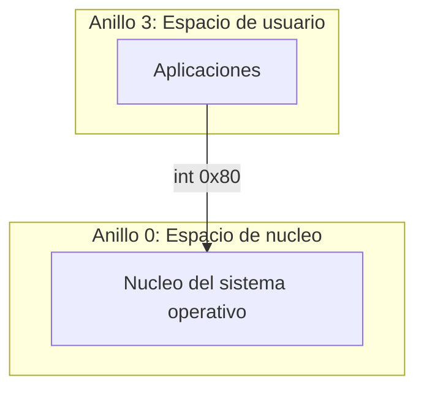
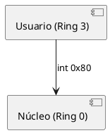

# Slide with Mermaid

```mermaid {scale: 0.75}
flowchart TB
  subgraph R3[Anillo 3: Espacio de usuario]
    App[Aplicaciones]
  end
  subgraph R0[Anillo 0: Espacio de nucleo]
    OS[Nucleo del sistema operativo]
  end
  App -->|int 0x80| OS
```

---

# Slide with LaTeX

$$
	ext{Longitud} = 	ext{NOT}(ECX) - 1
$$

---

# Slide with PlantUML

```plantuml
@startuml
skinparam backgroundColor transparent
skinparam defaultFontName sans-serif
[Usuario (Ring 3)] --> [Núcleo (Ring 0)] : int 0x80
@enduml
```
