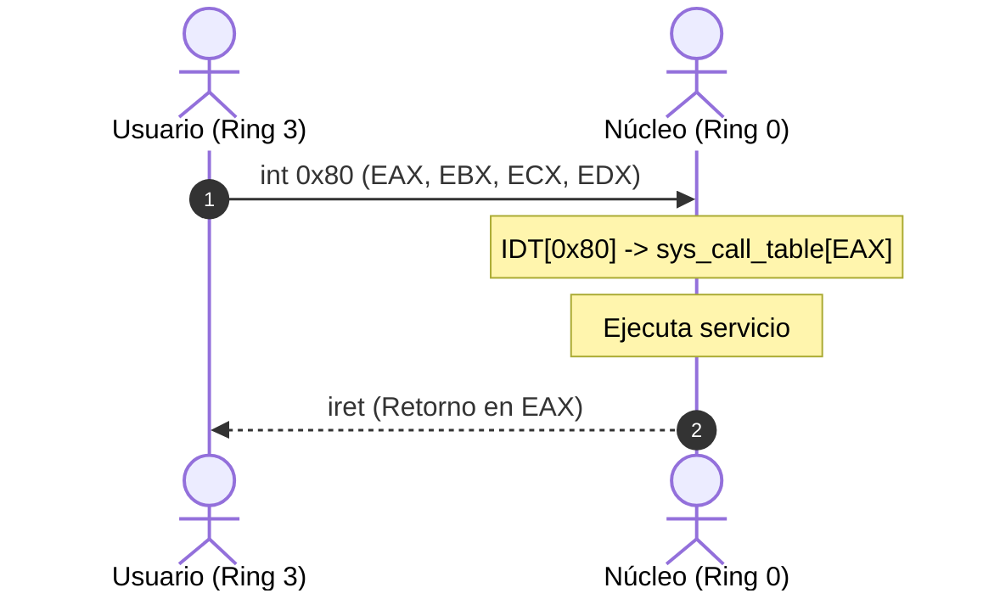

# Mecanismo de interrupciones

Flujo de transición entre espacio de usuario y núcleo.

  

    <strong class="text-amber-400">1. int 0x80:</strong> Excepción por software controlada.
  

  

    <strong class="text-cyan-400">2. Conmutación:</strong> CPU conmuta a Anillo 0.
  

  

    <strong class="text-emerald-400">3. iret:</strong> Núcleo retorna a Anillo 3.
  

::right::

